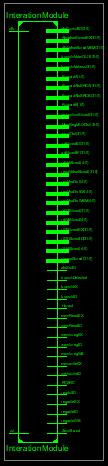
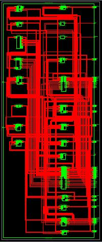
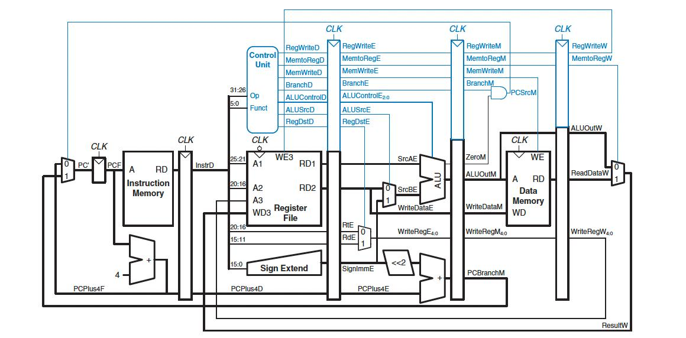

# Five-Stage Pipelined Processor (Verilog)

This project implements a five-stage pipelined processor in Verilog with comprehensive hazard handling. It demonstrates instruction-level parallelism using forwarding, stalling, and hazard detection techniques across modular RTL design. The processor supports a MIPS-like instruction set and simulates real-world data and control hazards.

---

## 📖 Project Overview

This Verilog-based CPU project is designed to simulate a five-stage pipelined processor with support for:

- Stall-only hazard handling
- Forwarding-only hazard handling
- Combined stall + forwarding mode

It handles data and control hazards, includes a testbench, and is built with reusable modules for each pipeline stage.

---

## 🚀 Features

- Full 5-stage pipeline: Fetch, Decode, Execute, Memory, Write-back
- Implements forwarding and stalling mechanisms
- Hazard detection and resolution units
- Branch prediction logic (basic PCSRC control)
- Modular RTL components
- Instruction and data memory
- Comprehensive simulation testbench

---

## 🔧 Technologies Used

- **Language:** Verilog
- **Simulator:** ModelSim / Vivado / Xilinx ISim
- **Design Units:** Modular RTL components
- **Testbench:** Included (only for the top module)

---

## 🧠 Pipeline Architecture

| Stage      | Module(s)           | Description                          |
|------------|---------------------|--------------------------------------|
| IF (Fetch) | `pc`, `inst_mem`    | Fetch instruction from memory        |
| ID (Decode)| `Decoder`, `reg_file`, `IFID`, `ControlUnit` | Decode instruction, fetch operands |
| EX         | `IDEX`, `Alu`, `AluSrc`, `ForwardingUnit`, `ForwardMux` | Execute ALU ops and forward data |
| MEM        | `EXMEM`, `datamemory` | Access memory for lw/sw instructions |
| WB         | `MEMWB`, `memTOregMux` | Write result back to registers      |

---

## 📄 Project Report

A full report detailing the design, simulation results, hazard handling logic, and synthesis is available:

👉 [Project Report (PDF)](report/project_report.pdf)

---

## 💻 Source Code

All Verilog modules and the testbench are available in the [`code/`](code/) directory.

---

## 📸 Diagrams

RTL diagrams and a full architectural block diagram are included to illustrate the datapath, control flow, and hazard resolution logic.

  
   
  

---

## 👥 Contributors

- [Aleeza Rizwan](https://github.com/its-aleezA)
- [Muhammad Ibrahim Abdullah](https://github.com/Ibrahim5570)
- Aina Ajmal
- Aameena Qadeer

---

## 🔖 License

This project is licensed under the MIT License.  
See the [LICENSE](LICENSE) file for full details.
